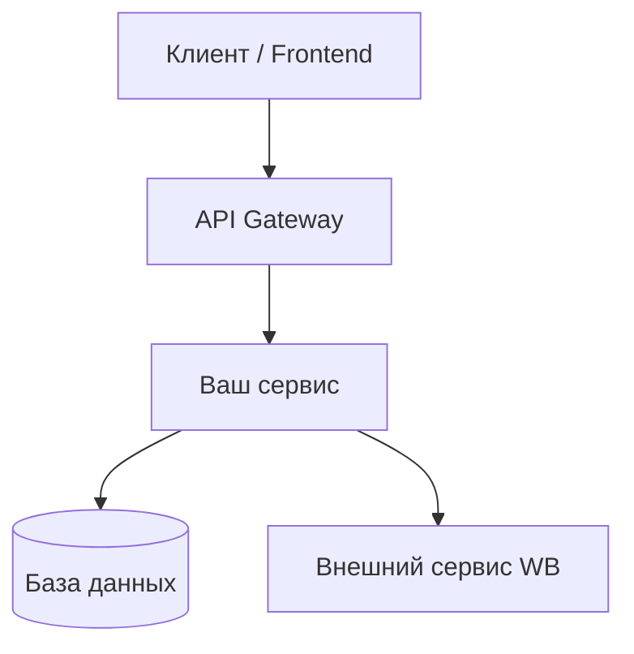

! Пишет Разработчик

# ADR-XXXX: [Название решения]

> **Заполни заголовок:** Кратко опиши суть технического решения.  
> Пример: `ADR-0001: Использование PostgreSQL для хранения событий промо-механик`

---

| Поле | Значение |
|---|---|
| **Статус** | `Draft` / `Proposed` / `Approved` / `Rejected` / `Superseded` |
| **Дата** | ГГГГ-ММ-ДД |
| **Авторы** | @username1, @username2 |
| **Ревьюеры** | @username3, @username4 |

---

## 1. Контекст и постановка задачи

### 1.1 Бизнес-логика и требования

**Ключевые бизнес-процессы:**

> Опиши, какой бизнес-процесс автоматизирует или поддерживает ваша фича.  
> Пример: «Мерчанты создают акционные предложения; покупатели видят скидки на карточке товара и в корзине.»

- [ ] Бизнес-процесс 1: _описание_
- [ ] Бизнес-процесс 2: _описание_

**Ожидания заказчика (SLA):**

> Укажи конкретные числа: время ответа, доступность, RPS.  
> Пример: «p99 latency ≤ 200ms, uptime 99.9%, до 500 RPS в пиковые часы.»

| Метрика | Значение | Измерение |
|---|---|---|
| Latency (p99) | ≤ ___ ms | APM/Grafana |
| Доступность | ≥ ___% | мониторинг |
| Пиковый RPS | ___ | нагрузочное тестирование |

**Out of Scope:**

> Явно перечисли, что НЕ входит в текущую итерацию. Это защищает команду от scope creep.

- _Функциональность X_ — вынесена в ADR-XXXX / следующий спринт
- _Интеграция с Y_ — за пределами нашей команды

**Ссылки:**

- YouTrack эпик: [EPIC-XXXX](https://youtrack.wb.ru/...)
- WB Band обсуждения: [Название треда](https://band.wb.ru/...)

---

## 2. Предлагаемое решение

### 2.1 Диаграмма решения

> Добавь диаграмму архитектуры. Используй PlantUML, Mermaid или LikeC4.  
> Минимум: покажи сервисы, потоки данных, внешние зависимости.



> _Замени на реальную диаграмму вашей архитектуры._

### 2.2 Модель данных и хранение

> Опиши структуру данных: таблицы/коллекции, объёмы, стратегию шардирования.

**Оценка объёмов:**

| Сущность | Строк/документов | Прирост в день | Стратегия |
|---|---|---|---|
| _Название_ | _оценка_ | _оценка_ | partitioning / sharding / архивирование |

**Схема (упрощённая):**

```sql
-- Пример таблицы
CREATE TABLE your_entity (
    id          BIGSERIAL PRIMARY KEY,
    -- поля
    created_at  TIMESTAMPTZ NOT NULL DEFAULT now()
);
```

**Шардирование / партиционирование:**

> Нужно ли шардировать? По какому ключу? Если нет — почему таблицы останутся управляемого размера?

### 2.3 API и интерфейсы

**Потребители (consumers):**

> Кто будет вызывать ваш API? Другие сервисы WB, мобильное приложение, фронтенд?

| Потребитель | Тип интеграции | Частота вызовов |
|---|---|---|
| _Сервис X_ | gRPC / REST / Kafka | _оценка_ |

**Контракты:**

> Ссылки на swagger/OpenAPI или .proto файлы.

- Swagger/OpenAPI: [ссылка](...)
- Protobuf: [ссылка на репозиторий](...)

**Ключевые эндпоинты (summary):**

| Метод | Путь | Описание |
|---|---|---|
| GET | `/api/v1/...` | _что делает_ |
| POST | `/api/v1/...` | _что делает_ |

---

## 3. Информационная безопасность

> Обязательно для каждого ADR. Даже если ответ «не применимо» — напиши явно почему.

| Тип данных | Обрабатывается? | Меры защиты |
|---|---|---|
| Персональные данные (ПДн) | Да / Нет | _шифрование, маскирование, аудит-лог_ |
| Платёжная информация | Да / Нет | _PCI DSS, токенизация_ |
| Токены / API-ключи | Да / Нет | _Vault, не в логах, ротация_ |

**Аутентификация и авторизация:**

> Как будет проверяться, что запрос легитимен?

- Механизм: _JWT / mTLS / внутренний токен WB_
- Проверка прав: _RBAC / ABAC / без авторизации (internal only)_

---

## 4. Интеграции и зависимости

> Перечисли все внешние сервисы и команды, от которых зависит ваше решение.

| Сервис / команда | Тип зависимости | Что произойдёт при отказе | Ответственный |
|---|---|---|---|
| _Название_ | синхронная / асинхронная / данные | деградация / fallback / критический сбой | @команда |

**Чего ещё нет, но нужно:**

- [ ] Согласовать контракт с командой _X_ до _дата_
- [ ] Получить доступ к _ресурсу Y_

---

## 5. Альтернативы

> Рассмотри минимум 2 альтернативы. Таблица помогает команде понять, почему выбрано именно это решение.

| Альтернатива | Плюсы | Минусы | Почему отказались |
|---|---|---|---|
| _Вариант A (выбранный)_ | _список_ | _список_ | — (это наш выбор) |
| _Вариант B_ | _список_ | _список_ | _конкретная причина_ |
| _Вариант C_ | _список_ | _список_ | _конкретная причина_ |

---

## 6. Технический долг

> Что делается «не идеально» из-за сроков? Задокументируй осознанные компромиссы.

| Компромисс | Причина | Когда устраним | Тикет |
|---|---|---|---|
| _Описание_ | _deadline / MVP_ | _Q2 2026 / следующий спринт_ | [TECH-XXXX](https://youtrack.wb.ru/...) |

> Если технического долга нет — напиши: «Технического долга на текущую итерацию нет.»

---

## 7. Декомпозиция

### Видение (архитектурное)

> 2-3 предложения: как система выглядит после завершения работ.

### Оценка трудозатрат

| Задача | Оценка (ч/дн) | Исполнитель |
|---|---|---|
| Проектирование схемы БД | ___ | _разработчик_ |
| Реализация бизнес-логики | ___ | _разработчик_ |
| API контракты | ___ | _разработчик_ |
| Написание тестов | ___ | _разработчик_ |
| Деплой и мониторинг | ___ | _devops / разработчик_ |
| **Итого** | **___** | |

---

## 8. Test Notes

> Что нужно проверить? Сосредоточься на нетривиальных кейсах — happy path не считается.

**Сложная логика и corner cases:**

- [ ] _Кейс: что происходит при X?_
- [ ] _Граничное значение: пустой список / максимальный размер_
- [ ] _Параллельные запросы / race condition_

**Падение зависимостей:**

| Сценарий | Ожидаемое поведение |
|---|---|
| Внешний сервис вернул 500 | _retry / fallback / ошибка пользователю_ |
| Timeout при обращении к БД | _circuit breaker / ошибка с кодом_ |
| Kafka недоступна | _буферизация / деградация функциональности_ |

**Транзакции и идемпотентность:**

- [ ] Повторный запрос с тем же ID не создаёт дублей (идемпотентность)
- [ ] При сбое в середине операции данные остаются консистентными
- [ ] Retries реализованы с backoff

---

## 9. Наблюдаемость (Observability)

> Как мы узнаем, что система работает правильно (или сломалась)?

**Бизнес-метрики:**

| Метрика | Описание | Инструмент |
|---|---|---|
| _Конверсия X_ | _что измеряет_ | Grafana / DataLens |

**Технические метрики:**

| Метрика | Норма | Алерт при |
|---|---|---|
| Request rate | ___ RPS | < ___ RPS |
| Error rate | < 1% | > 5% |
| Latency p99 | < 200ms | > 500ms |
| DB connection pool | < 80% | > 90% |

**Алерты:**

- [ ] Настроен алерт на error rate > 5% → on-call
- [ ] Настроен алерт на p99 latency > 500ms → команда
- [ ] Dashboard создан в Grafana: [ссылка](...)

**Логирование:**

- [ ] Structured logs (JSON)
- [ ] Уровень для ошибок: ERROR с stack trace
- [ ] Чувствительные данные (ПДн, токены) не попадают в логи

---

## 10. Чек-лист рисков (Pre-release)

> Заполни перед выходом в продакшн. Все пункты должны быть закрыты или объяснено, почему неприменимо.

### Готовность к релизу

- [ ] ADR прошёл ревью и статус `Approved`
- [ ] Код прошёл code review (минимум 2 апрувера)
- [ ] Все тесты зелёные в CI/CD
- [ ] Нагрузочное тестирование проведено (или обоснован отказ)
- [ ] Секреты и конфиги не захардкожены

### Безопасность

- [ ] Аутентификация и авторизация проверены
- [ ] ПДн обрабатываются в соответствии с политиками WB
- [ ] Уязвимости из SAST-сканера устранены

### Операционная готовность

- [ ] Runbook написан
- [ ] Дашборды и алерты настроены
- [ ] On-call ознакомлен с изменениями
- [ ] Rollback план протестирован

---

## 11. План релиза и отката

### Стратегия деплоя

> Как деплоим? Canary, blue-green, feature flag, прямой деплой?

- Стратегия: _canary / blue-green / rolling / direct_
- Шаги деплоя:
  1. _Шаг 1_
  2. _Шаг 2_
  3. _Включение feature flag для 1% трафика_
  4. _Мониторинг 24 часа_
  5. _Полный rollout_

### Обратная совместимость

- [ ] API обратно совместим (старые клиенты не сломаются)
- [ ] Миграция БД обратно совместима (поддерживает откат без потери данных)
- [ ] Если несовместим — описан план миграции клиентов

### План отката (Rollback)

> Что делать, если что-то пошло не так?

| Шаг | Действие | Ответственный | Время |
|---|---|---|---|
| 1 | Обнаружили проблему по алертам | on-call | — |
| 2 | Откатить деплой (helm rollback / feature flag off) | DevOps / разработчик | < 5 мин |
| 3 | Откатить миграцию БД (если применимо) | DBA / разработчик | < 15 мин |
| 4 | Уведомить стейкхолдеров | тимлид | < 30 мин |
| 5 | Провести post-mortem | вся команда | в течение 48ч |

**Триггеры для отката:**

- Error rate > 10% в течение 5 минут
- p99 latency > 1000ms
- Критическая ошибка, влияющая на бизнес-процесс

