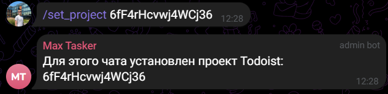
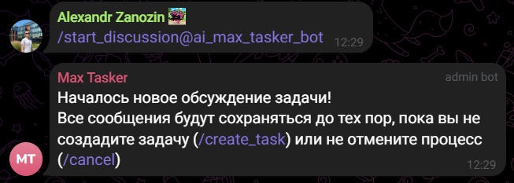
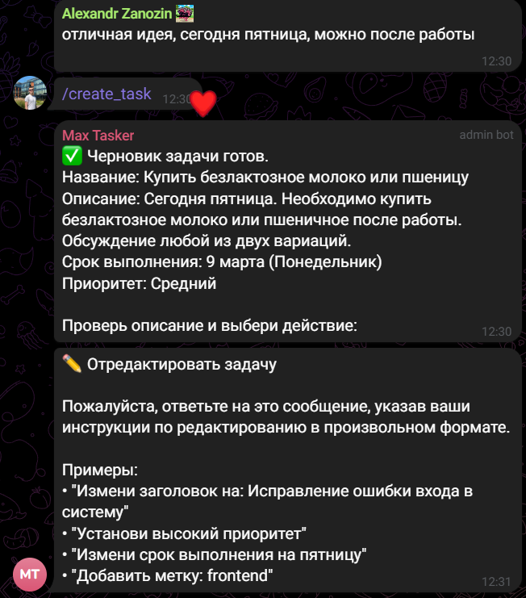
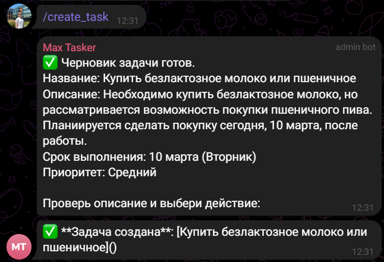

Бот Телеграмма для создания задач в командынх проектах.
---
  
  
  
# Содержание
- [О чем этот проект?](#о-чем-этот-проект)
- [Основные команды](#основные-команды)

## О чем этот проект?
Проект создан для упрощения создания задач в таких ПО, как Jira.  
Позволяет привязывать **Бота** к проекту с задачами.  

Основной функционал:
- Анализирование сообщений
- Создание шаблона задач
- Публикация в Таск трекер

## Как начать работу?
Запустить локально проект и добавить бота в отдельный Telegram чат

## Основные команды
### `/set_project`   
Установка референса к таск трекеру

#### Пример
>`/set_project AAAAAAAAA`

Демонстрация  

---
### `/start_discussion`
Метка для бота о начале обсуждения.

#### Пример 
**Обязательно** указать ник бота  
>`/start_discussion@change_to_your_tg_bot`

Демонстрация   

---
### `/create_task` 

После обсуждения с `/start_discussion`, подвести итоги и создать черновик задачи  

#### Пример
>`/create_task`

Демонстрация   

Повторный вызов `/create_task` создает задачу в таск трекере.  
Для изменения задачи необходимо ОТВЕТИТЬ на сообщение бота с черновиком.

---

### `/cancel` 
Отмена начала обсуждения `/start_discussion`

#### Пример 
> `/cancel`

---

